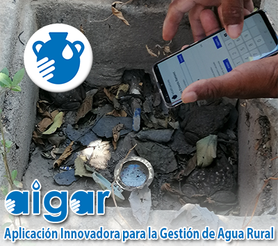

# AIGAR: Aplicación Innovadora para la Gestión de Juntas de Aguas Rurales

La Aplicación Innovadora para la Gestión de Agua Rural (AIGAR) es una aplicación desarrollada por [iCarto](https://icarto.es/) en colaboración con [Ingeniería Sin Fronteras Cataluña](https://esf-cat.org/), [ACUA](http://acua.org.sv/) y ASAPS. AIGAR ha sido financiada a través de diferentes proyectos con el apoyo de la AGENCIA ESPAÑOLA DE COOPERACIÓN INTERNACIONAL PARA EL DESARROLLO ([AECID](https://www.aecid.es)) y la [Xunta de Galicia](https://cooperacion.xunta.gal/es).

AIGAR es una herramienta diseñada a medida para mejorar la competencia administrativa y organizativa de las Juntas Administradoras de los sistemas de Agua Potable y Saneamiento rurales (Juntas de agua).

Está compuesta por dos aplicaciones libres (licencia AGPL) y gratuitas:

-   **AIGAR-Lecturas**: Aplicación móvil que permite la recolección de los datos de consumo de agua de los socios y socias del sistema de agua. [Repositorio](https://github.com/iCarto/aigar-lecturas).
-   **AIGAR-Escritorio**: Aplicación web que permite la gestión administrativa del sistema de agua. Incluye la gestión del catastro de personas socias del sistema y todo el proceso de facturación. [Repositorio](https://github.com/iCarto/aigar).

Este repositorio contiene la aplicación móvil **AIGAR-Lecturas**. Está desarrollada con tecnologías web y empaquetada para Android con Apache Cordova. La aplicación permite al personal de Juntas de Agua realizar la lectura de los medidores/contadores instalados en las viviendas de los asociados en el orden que la persona fontanera realiza la toma de lecturas. Contiene la información de todos los socio/as del sistema: nombre, número de socio/a, número de contador y consumo anterior.

Para más información puedes consultar la [página web de AIGAR](https://icarto.github.io/aigar-web/) o puedes escribir a iCarto,  ACUA o ASAPS para consultar la metodología de implementación, buenas prácticas, posibles problemas o lo que necesites.

# Capturas

