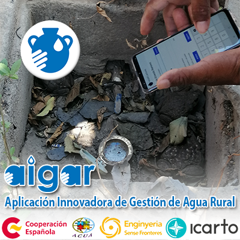
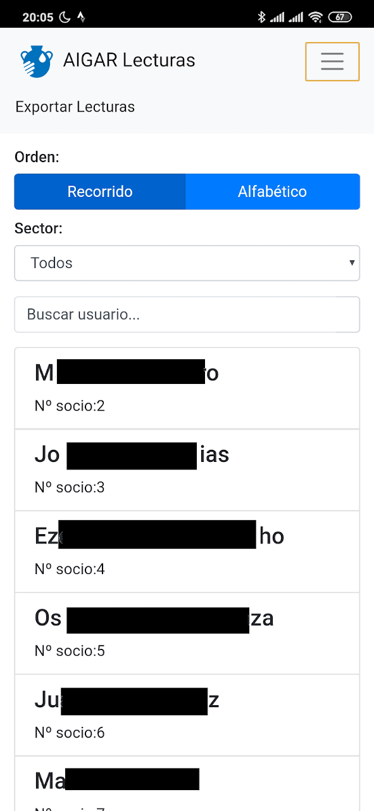
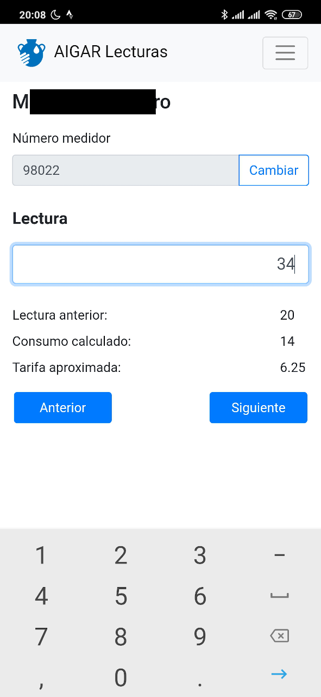

AIGAR: Aplicación Innovadora para la Gestión de Juntas de Aguas Rurales

AIGAR es una aplicación desarrollada por [iCarto](https://icarto.es/) en colaboración con [Ingeniería Sin Fronteras Cataluña](https://esf-cat.org/) y [ACUA](http://acua.org.sv/).

AIGAR está financiado por la AGENCIA ESPAÑOLA DE COOPERACIÓN INTERNACIONAL PARA EL DESARROLLO, [AECID](https://www.aecid.es), a través del proyecto “Aplicación de soluciones integrales e innovadoras para la sostenibilidad y buena gestión de los sistemas comunitarios de agua en El Salvador”, presentado a la convocatoria de Acciones de Cooperación Para el Desarrollo correspondiente al año 2018 para la Realización de Proyectos de Innovación para el Desarrollo.

Este repositorio contiene la aplicación móvil (desarrollada con tecnologías web y empaquetada para Android con Apache Cordova) denominada AIGAR-Lecturas. AIGAR-Lecturas permite al personal de Juntas de Agua de comunidades rurales realizar la lectura de los medidores instalados en las viviendas de los asociados.

La aplicación en este momento está muy ligada a la forma de trabajo de ASCATLI la Junta de Agua que se ha escogido como piloto para este proyecto. El sistema de agua que administra ASCATLI tiene alrededor de 250 socias y comprende las comunidades de Tihuapa Norte y Tlacuxtli, en el municipio del Puerto de la Libertad en El Salvador.

Puedes descargar y probar la aplicación desde el [apartado de relases](https://gitlab.com/icarto/aigar/-/relases). Llega con descomprimir el zip y hacer doble click en el fichero `AIGAR.exe`. La aplicación contiene una base de datos vacía.

La [aplicación móvil](https://gitlab.com/icarto/aigar) se complementa con la [aplicación de escritorio AIGAR](https://gitlab.com/icarto/aigar-lecturas), que a partir de estas lecturas recogidas, permite gestionar el resto de proceso de facturación. 

Ambas aplicaciones son libres (licencias GPL y AGPL) y gratuitas.

Si eres una ONG y estás planteándote usar algo similar en tu proyecto puedes escribir a [iCarto](https://icarto.es/contacta/), [ISF-Cataluña](https://esf-cat.org/es/contacta/) o [ACUA](http://acua.org.sv/index.php/contactenos) para hablar sobre la identificación del proyecto, buenas prácticas, posibles problemas o lo que necesites.

# Capturas

